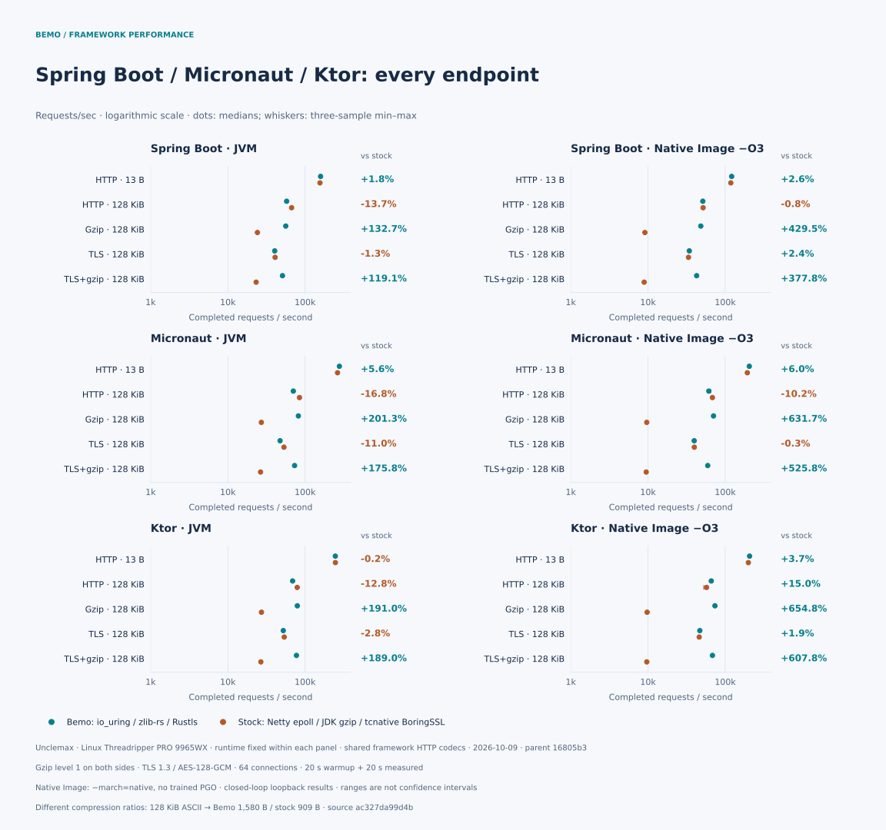

[](https://elide.dev/discord)


[](https://codecov.io/gh/elide-dev/bemo)
[](https://codspeed.io/elide-dev/bemo)

# Netty, powered by Rust

Bemo adds native I/O, [Rustls](https://github.com/rustls/rustls) TLS with
[AWS-LC](https://github.com/aws/aws-lc-rs), and
[zlib-rs](https://github.com/trifectatechfoundation/zlib-rs) compression to
[Netty](https://netty.io). It runs on the JVM through FFM or links statically
into GraalVM Native Image. Your application keeps its Netty pipelines and handlers.
Framework HTTP codecs stay in Java; the [native HTTP server path](docs/native-http-example.md)
is a separate integration.

## Usage

Bemo **0.3.0** is on Maven Central. For a Netty application on **JDK 22+**, add
the dependencies below and run with `--enable-native-access=ALL-UNNAMED`.
Qualified packages target **Linux x86-64 / glibc 2.39** and **macOS 15 / ARM64**.
Netty TLS requires the classpath. Windows, musl/Alpine, Linux ARM64, and Intel
macOS packages are not qualified. The snippets use Linux; on macOS ARM64, replace
`linux-x86_64-gnu` with `osx-aarch64`.

<details open>
<summary><strong>Gradle</strong> (build.gradle.kts)</summary>

```kotlin
repositories { mavenCentral() }

dependencies {
  implementation("dev.elide.bemo:bemo-netty:0.3.0")
  implementation("dev.elide.bemo:bemo-ffm:0.3.0")
  runtimeOnly("dev.elide.bemo:bemo-ffm:0.3.0:linux-x86_64-gnu")
}
```

</details>

<details>
<summary><strong>Maven</strong> (pom.xml)</summary>

Maven uses Central by default. Add these dependencies inside `<project>`:

```xml
<properties>
  <bemo.version>0.3.0</bemo.version>
</properties>

<dependencies>
  <dependency>
    <groupId>dev.elide.bemo</groupId>
    <artifactId>bemo-netty</artifactId>
    <version>${bemo.version}</version>
  </dependency>
  <dependency>
    <groupId>dev.elide.bemo</groupId>
    <artifactId>bemo-ffm</artifactId>
    <version>${bemo.version}</version>
  </dependency>
  <dependency>
    <groupId>dev.elide.bemo</groupId>
    <artifactId>bemo-ffm</artifactId>
    <version>${bemo.version}</version>
    <classifier>linux-x86_64-gnu</classifier>
    <scope>runtime</scope>
  </dependency>
</dependencies>
```

</details>

<details>
<summary><strong>Gradle version catalog</strong></summary>

In `gradle/libs.versions.toml`:

```toml
[versions]
bemo = "0.3.0"

[libraries]
bemo-netty = { module = "dev.elide.bemo:bemo-netty", version.ref = "bemo" }
bemo-ffm = { module = "dev.elide.bemo:bemo-ffm", version.ref = "bemo" }
```

In `build.gradle.kts`:

```kotlin
repositories { mavenCentral() }

dependencies {
  implementation(libs.bemo.netty)
  implementation(libs.bemo.ffm)
  runtimeOnly(variantOf(libs.bemo.ffm) { classifier("linux-x86_64-gnu") })
}
```

The classifier belongs in the build script; [version catalogs](https://docs.gradle.org/current/userguide/version_catalogs.html#sec:classifiers-artifact-types-capabilities)
store the module and version.

</details>

Bemo loads the native library from the classifier JAR automatically. See the
[package guide](docs/publishing.md) for platform requirements and Native Image
linking. Start the [complete Maven or Gradle quickstart](docs/installation.md#run-a-complete-server)
without building Bemo. It returns `Hello, World!` at
`http://127.0.0.1:8080/plaintext`. The [framework examples](docs/framework-examples.md)
are separate source-build examples.

### Java and Netty

This integration fragment creates an event-loop group for a `ServerBootstrap`:
[the quickstart](examples/quickstart) supplies the complete runnable server.

```java
import dev.elide.bemo.transport.FfmTransportNative;
import dev.elide.bemo.transport.NativeIoHandler;
import dev.elide.bemo.transport.NativeServerSocketChannel;
import dev.elide.bemo.transport.Workload;
import io.netty.channel.MultiThreadIoEventLoopGroup;

var transport = new FfmTransportNative();
var group = new MultiThreadIoEventLoopGroup(
  2, NativeIoHandler.newFactory(transport, 0, 128, 8 * 1024 * 1024));
// Supply group and NativeServerSocketChannel.class to your ServerBootstrap.

// After closing your channels, release the event loops and default workload:
group.shutdownGracefully().sync();
Workload.close(transport, Workload.DEFAULT);
```

For Native Image, use `dev.elide.bemo.transport.svm.CapiTransportNative` and
the static library from the `bemo-native-image` platform classifier. See the
[static linking instructions](docs/publishing.md#static-linkage).

The [transport examples](tests/transport/java) cover TCP, Unix sockets, and TLS,
including setup and shutdown. Netty TLS currently requires the classpath rather
than JPMS. For library paths and extraction settings, see
[native loading](docs/native-loading.md).

### Rust

To use the Rust core directly, pin a full commit SHA:

```toml
[dependencies]
bemo = { git = "https://github.com/elide-dev/bemo", rev = "<full-commit-sha>" }
```

For C exports, add `bemo-ffi` at the same revision. Public headers live in
[`include`](include); the `bemo` crate itself has no JVM or Netty dependency.

## Performance

[Fresh development benchmarks](docs/performance/launch-refresh.md) measure
**`16805b3` plus the recorded benchmark harness patch**, 2026-10-09 UTC,
on a Linux Threadripper PRO 9965WX. This revision follows release **0.3.0**;
these are development results. Benchmark builds use Rust `target-cpu=native`
and Native Image `-O3 -march=native`. Release build defaults remain portable;
downloaded Netty JNI libraries retain their published CPU targets.

The full-stack comparison uses Bemo Native Image / native HTTP / io_uring /
Rustls against OpenJDK 25.0.2 / Netty HTTP / epoll / tcnative BoringSSL.
It includes runtime and codec differences. Native Image is GraalVM
25.3.4.1+1.1. Large uncompressed TLS throughput is near parity (−0.6% and −0.1%).


The framework matrix measures the same **`16805b3` snapshot, 2026-10-09 UTC**,
with Spring Boot, Micronaut, and Ktor on OpenJDK 25.0.2 and GraalVM Native Image
`-O3 -march=native`. Runtime and framework HTTP codecs stay fixed within each
pair. Compression compares reusable zlib-rs with the reusable **JDK Deflater**
helper at level 1:



Across gzip and TLS+gzip, throughput was **2.2–3.0×** the stock JVM framework
throughput and **4.8–7.5×** the stock Native Image throughput. Large uncompressed
plaintext JVM responses were **13–17% slower**; Native Image Micronaut was
**10% slower** there. Both sides used gzip level 1, but Bemo produced larger
compressed bodies: **1,580 vs. 909 bytes** for the 128 KiB framework payload.
Gains cannot be attributed only to transport.

These are closed-loop loopback measurements on a shared host, with three samples
per workload; ranges show observed minima and maxima, not confidence intervals.
The [report](docs/performance/launch-refresh.md) includes latency, CPU, memory,
raw samples, source hashes, and reproduction commands. Earlier measurements
remain [archived](docs/performance/README.md).

## Working on Bemo

Install Rustup, Python 3.11+, a C toolchain, CMake, a JDK 25 build toolchain,
and the Elide version in [`.elide-version`](.elide-version). Rustup selects
the pinned Rust toolchain automatically. Native Image tests need GraalVM
JDK 25 with `native-image`.

```sh
make deps
make build
make check
make test
make test-native-image
```

Cargo builds Rust; Elide compiles Java and builds the JARs. `make test` covers
Rust, a revision-pinned Cargo consumer, a C consumer, and the JVM FFM binding.
`make test-native-image` runs the shared Java contract through the static binding.
Run build commands sequentially because they share output directories.

Use `make package` and `python3 tools/verify_package.py` to stage and check
packages locally. Set `ELIDE` to choose the build executable, `JAVA_HOME` for
JVM tools, or `BEMO_TEST_JAVA` to test with another JVM. Windows builds also
need NASM or `AWS_LC_SYS_PREBUILT_NASM=1`; OpenSSL on `PATH` enables additional
TLS interoperability checks.

Source and documentation:

- [`crates/bemo`](crates/bemo): Rust core.
- [`crates/bemo-ffi`](crates/bemo-ffi) and [`include`](include): C interface.
- [`packages`](packages): Java API, FFM, Native Image, and Netty adapters.
- [Architecture](docs/architecture.md) and [I/O ownership](docs/transport-io.md): how the pieces fit together.
- [Measurement](docs/measurement.md) and [native safety](docs/native-safety.md): benchmarks, coverage, sanitizers, and fuzzing.

## About

Bemo is the main transport for [Elide](https://github.com/elide-dev/elide).
The name comes from the [minibuses](https://en.wikipedia.org/wiki/Share_taxi#Indonesia)
that carry people around Indonesia, including [Bali](https://github.com/elide-dev/bali).

Apache-2.0.
