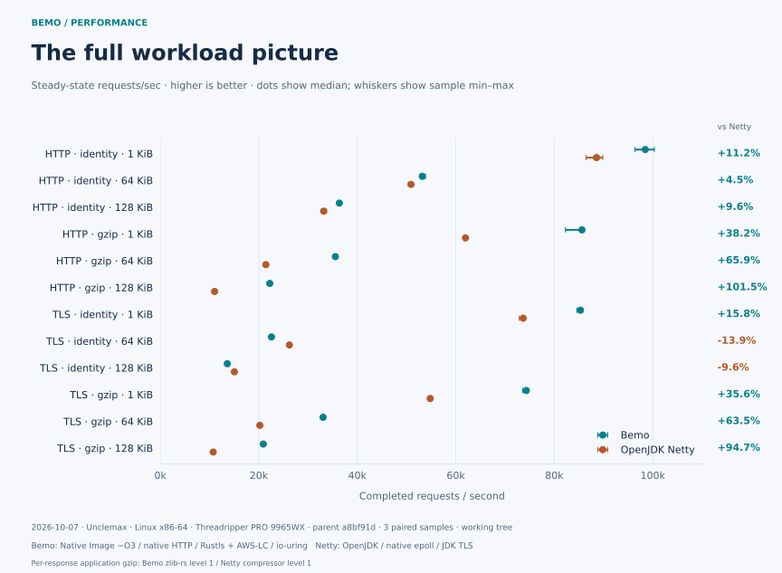
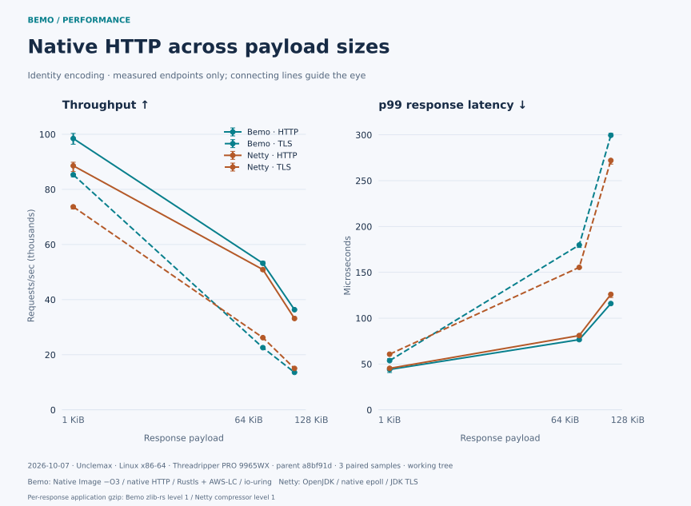
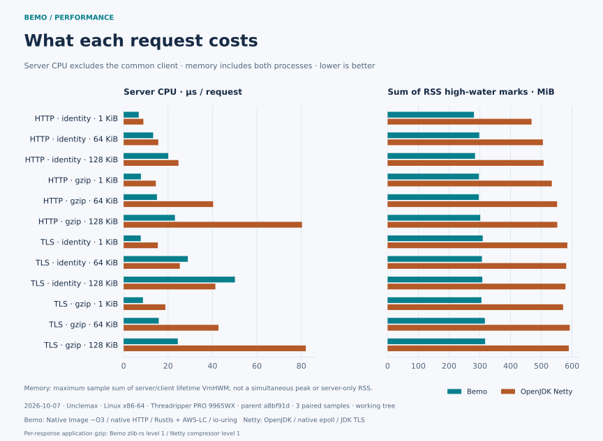
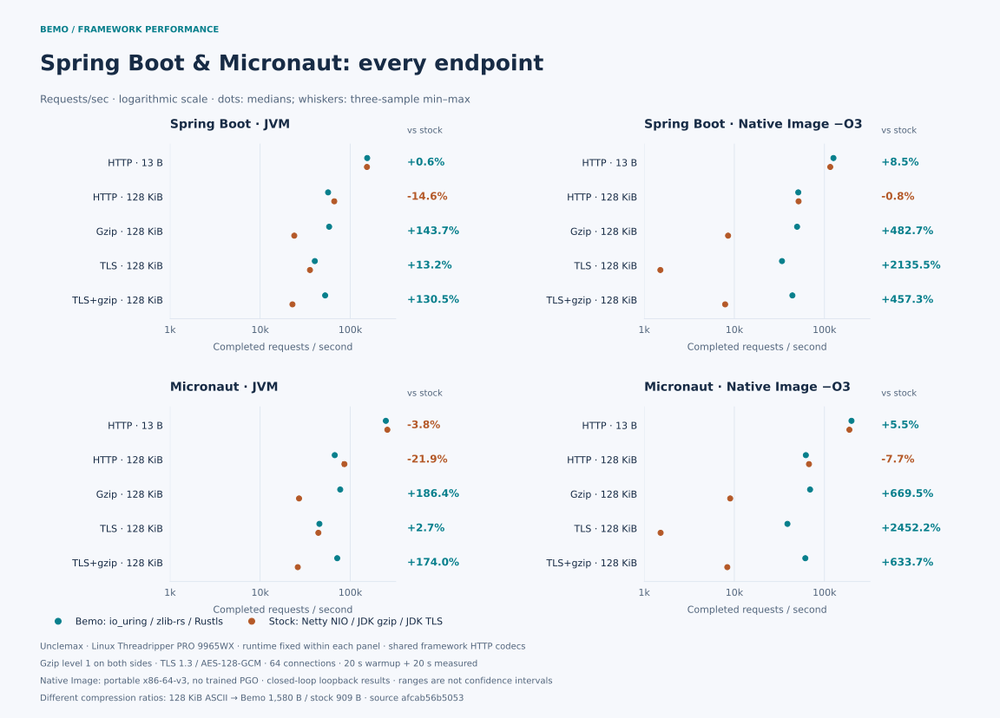

[](https://elide.dev/discord)


[](https://codecov.io/gh/elide-dev/bemo)
[](https://codspeed.io/elide-dev/bemo)

> A [_Bemo_][0] is a traditional, small open-air minibus or motorized rickshaw used as fast local **transport, especially in [Bali](https://github.com/elide-dev/bali)**.

---

# Netty fortified by Rust

_Bemo_ is a drop-in [native transport](https://netty.io/wiki/native-transports.html) for [Netty](https://netty.io), built with Rust, using best-of-breed APIs and libraries like [`io_uring`](https://en.wikipedia.org/wiki/Io_uring), [`tokio`](https://tokio.rs/), [`aws-lc-rs`](https://github.com/aws/aws-lc-rs), [`rustls`](https://github.com/rustls/rustls), [`zlib-rs`](https://trifectatech.org/blog/zlib-rs-is-faster-than-c/), [`ntex`](https://ntex.rs/), and [`simdutf`](https://github.com/simdutf/simdutf).

| Status | Feature |
| ------ | ------- |
| ✅ Drop-in | Replacement for Netty native transports (`io_uring`, `epoll`, `kqueue`) |
| ✅ Drop-in | Replacement for Netty "Tomcat Native" (`tcnative`) TLS |
| ✅ JVM | FFM binding with shared transport, TLS, and compression contracts |
| ✅ Native Image | Statically linked C binding with shared contracts |

_Bemo_ is used as the main transport for [Elide](https://github.com/elide-dev/elide).

## Usage

**Via Rust:**

```toml
[dependencies]
bemo = { git = "https://github.com/elide-dev/bemo", rev = "<full-commit-sha>" }
bemo-ffi = { git = "https://github.com/elide-dev/bemo", rev = "<full-commit-sha>" }
```

**Via JVM/SVM:**

The Maven coordinates are `dev.elide.bemo:bemo-api`, `bemo-ffm`,
`bemo-native-image`, and `bemo-netty`. Snapshot artifacts, sources, Javadocs,
and native classifiers are available from [GitHub Packages](docs/publishing.md). The FFM and
Native Image artifacts depend on the API artifact. GraalVM SDK dependencies
are confined to the Native Image artifact and marked `provided`.

```java
import dev.elide.bemo.transport.FfmTransportNative;
import dev.elide.bemo.transport.NativeIoHandler;
import dev.elide.bemo.transport.NativeServerSocketChannel;
import dev.elide.bemo.transport.Workload;
import io.netty.channel.MultiThreadIoEventLoopGroup;

var transport = new FfmTransportNative();
var group = new MultiThreadIoEventLoopGroup(
    2, NativeIoHandler.newFactory(transport, 0, 128, 8 * 1024 * 1024));
// Supply group and NativeServerSocketChannel.class to a Netty ServerBootstrap.
// After channels are closed:
group.shutdownGracefully().sync();
Workload.close(transport, Workload.DEFAULT);
```

For Native Image, construct `dev.elide.bemo.transport.svm.CapiTransportNative` instead.
The transport binding retains its library for process lifetime; caller-owned
workloads and event loops have explicit shutdown. See the executable contracts
in `tests/transport/java` for complete TCP, Unix socket, and TLS examples.

Run with `--enable-native-access=ALL-UNNAMED`. Include the base FFM JAR and its
platform classifier JAR; the no-argument constructor extracts and loads the
shared library automatically. Static archives ship in the Native Image classifier.
See [native loading](docs/native-loading.md) for configuration. Netty TLS uses
a package-private ALPN adapter and currently requires the classpath rather than JPMS. See [architecture](docs/architecture.md), [extraction boundaries](docs/extraction.md),
[Netty I/O ownership and batching](docs/transport-io.md).

## Performance

The [matched-level Unclemax measurements](docs/performance/unclemax-matched.md)
use **gzip level 1 on both sides** and **TLS 1.3 / AES-128-GCM**, three samples
per case, and verified response contents. All twelve basic HTTP/TLS workloads
and all five framework endpoints are retained, including regressions. These are closed-loop loopback measurements
on a shared Linux Threadripper PRO 9965WX host, not a universal speedup claim.

The archived basic matrix compares Bemo Native Image `-O3` with native HTTP, io_uring and
Rustls/aws-lc-rs against OpenJDK Netty epoll with Netty HTTP and JDK TLS.
It measures the complete stacks, including the different server runtimes.







The Spring Boot and Micronaut comparisons hold the runtime fixed within each
row. Native Images use `-O3` with the portable `x86-64-v3` default target.
They keep framework HTTP codecs; Bemo supplies native transport, gzip and
TLS, while stock mode in these archived measurements used Netty NIO, JDK gzip
and JDK TLS. The corrected harness requires native epoll/kqueue and tcnative;
these numbers do not describe that baseline. The table shows
Bemo throughput changes versus stock mode; the report retains absolute rates
and all sample ranges. Each endpoint uses 64 connections, with 20 seconds of
warmup and 20 seconds measured per fresh-server sample. TLS clients are pinned
to the same protocol and cipher; native images retain the portable default target.



| Framework | Runtime | HTTP 13 B | HTTP 128 KiB | Gzip 128 KiB | TLS 128 KiB | TLS+gzip 128 KiB |
| --- | --- | ---: | ---: | ---: | ---: | ---: |
| Spring Boot | JVM | +0.6% | -14.6% | +143.7% | +13.2% | +130.5% |
| Spring Boot | Native Image | +8.5% | -0.8% | +482.7% | +2135.5% | +457.3% |
| Micronaut | JVM | -3.8% | -21.9% | +186.4% | +2.7% | +174.0% |
| Micronaut | Native Image | +5.5% | -7.7% | +669.5% | +2452.2% | +633.7% |

Equal compression levels do not imply equal compressed sizes. For the 128 KiB
basic JSON body, zlib-rs level 1 produces **1,653 bytes**, Netty level 1 produces
**1,002 bytes**, and Netty level 6 produces **479 bytes**. The historical level-1
versus level-6 comparison is superseded; its small 1 KiB exception does not
justify retaining that mismatch across the matrix.

Ranges show observed sample minima and maxima, not confidence intervals.
Basic-chart memory sums server/client lifetime RSS high-water marks; framework
memory is server-only. The harnesses use different bodies, clients and concurrency,
so their absolute rates cannot be compared directly. The measured working tree,
parent commit, per-file hashes, toolchains, CPU affinity and raw samples are
checked in with [the evidence](docs/performance/unclemax-matched.md).
Run `make bench-graphs` to reproduce the charts; see
[chart refresh instructions](docs/performance/README.md).

## Layout

| Path | Responsibility |
| --- | --- |
| `crates/bemo` | Runtime-independent Rust core; consumable as a Cargo Git dependency |
| `crates/bemo-ffi` | One C boundary, built as `rlib`, `staticlib`, and `cdylib` |
| `include` | Bemo metadata ABI and preserved Elide transport ABI 3 |
| `packages/api` | JVM contract without runtime dependencies |
| `packages/ffm` | JDK 22+ dynamic-library adapter |
| `packages/native-image` | GraalVM C interop adapter for static linking |
| `packages/netty` | Stock Netty 4.2 channels, allocator, TLS, and event-loop adapter |
| `tests` | C and shared JVM binding contracts |
| `tools` | Build orchestration and artifact/consumer verification |
| `.github` | Reusable PR, push, merge-queue, check, build, and release-staging workflows |

## Develop

Install Rustup, Python 3.11+, a C toolchain, a JDK 25 build toolchain, and the
Elide version in `.elide-version`. Rustup selects `rust-toolchain.toml`.
Use a GraalVM JDK 25 with `native-image` for the static binding test. AWS-LC
requires CMake; Windows additionally needs NASM or `AWS_LC_SYS_PREBUILT_NASM=1`.
OpenSSL on PATH enables additional TLS interoperability checks.
The FFM artifact targets regular JDK 22+, without preview features.

```sh
make deps
make build
make check
make test
make test-native-image
make package
python3 tools/verify_package.py
```

`make test` covers Rust, an external revision-pinned Cargo Git consumer, a C
consumer, and FFM on the JVM. `make test-native-image` compiles and executes the
same JVM contract against the static C binding. CI tests FFM on Temurin 22 and
25; Rust on Linux, macOS, and Windows; Native Image on Linux. JVM packaging is
initially Linux glibc x86-64 and macOS ARM64. Windows JVM and musl packaging are
not yet qualified.

Set `ELIDE` to select the build executable, `JAVA_HOME` for JVM tools, or
`BEMO_TEST_JAVA` to run the FFM contract with a separate stock JVM. Standard
Cargo `CARGO_TARGET_DIR` is supported. Cross-compilation is not wired into the
host binding tests or packaging commands. Build commands share output folders;
run them sequentially in a checkout.

## Licensing

Licensed under Apache-2.0.

Test XML, coverage, and continuous CPU/RPS/RSS benchmarks are described in
[the measurement guide](docs/measurement.md).
ASAN, TSAN, Miri, and bounded native fuzzing are described in
[native safety verification](docs/native-safety.md).

Minimal Spring Boot, Micronaut, and Ktor applications support JVM and Native Image builds
with Elide, Maven, and Gradle, including native gzip, TLS, and TLS+gzip workloads.
See [the framework examples guide](docs/framework-examples.md).

[0]: https://en.wikipedia.org/wiki/Share_taxi#Indonesia
