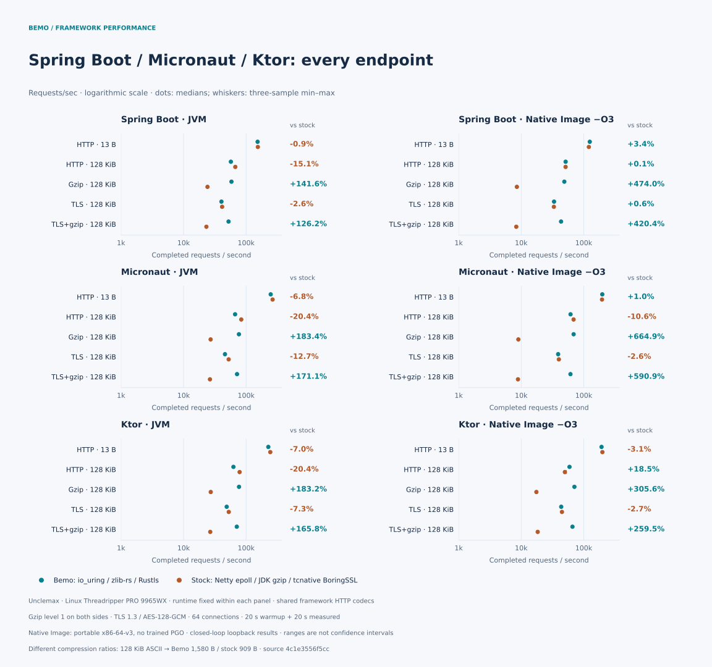

[](https://elide.dev/discord)


[](https://codecov.io/gh/elide-dev/bemo)
[](https://codspeed.io/elide-dev/bemo)

# Netty, powered by Rust

Bemo brings Rust networking, TLS, and compression to [Netty](https://netty.io).
Keep your Netty pipelines and application handlers; use Bemo's channels and
event loops for native I/O, [Rustls](https://github.com/rustls/rustls) with
[AWS-LC](https://github.com/aws/aws-lc-rs) for TLS, and
[zlib-rs](https://github.com/trifectatechfoundation/zlib-rs) for compression.
It runs on the JVM through FFM and links statically into GraalVM Native Image.

Bemo is the main transport for [Elide](https://github.com/elide-dev/elide).
Its name comes from the [small minibuses](https://en.wikipedia.org/wiki/Share_taxi#Indonesia)
that carry people around Indonesia—including [Bali](https://github.com/elide-dev/bali).

## Try it

The [Spring Boot, Micronaut, and Ktor examples](docs/framework-examples.md)
are a good place to start. Each has Elide, Maven, and Gradle builds, runs on
the JVM or as a Native Image, and serves HTTP, HTTPS, and gzip responses.
You can switch between Bemo and stock Netty with a runtime flag.

### Java and Netty

Use **JDK 22+** for the FFM binding. Packages are available for **Linux glibc
x86-64** and **macOS ARM64**; see the [package guide](docs/publishing.md) for
platform requirements, Maven configuration, and GitHub Packages authentication.

All artifacts use the Maven group `dev.elide.bemo`:

| Artifact | Use it for |
| --- | --- |
| `bemo-netty` | Netty 4.2 channels, event loops, buffers, and TLS |
| `bemo-ffm` | Loading Bemo on a regular JVM |
| `bemo-native-image` | Statically linking Bemo into a GraalVM Native Image |
| `bemo-api` | Shared Java interfaces; included by the bindings |

For a JVM application, add `bemo-netty`, `bemo-ffm`, and the `bemo-ffm`
classifier for your platform (`linux-x86_64-gnu` or `osx-aarch64`). The binding
loads the native library from the classifier JAR automatically.
Run with `--enable-native-access=ALL-UNNAMED`.

Here is the event-loop setup for a Netty server:

```java
import dev.elide.bemo.transport.FfmTransportNative;
import dev.elide.bemo.transport.NativeIoHandler;
import dev.elide.bemo.transport.NativeServerSocketChannel;
import dev.elide.bemo.transport.Workload;
import io.netty.channel.MultiThreadIoEventLoopGroup;

var transport = new FfmTransportNative();
var group = new MultiThreadIoEventLoopGroup(
  2, NativeIoHandler.newFactory(transport, 0, 128, 8 * 1024 * 1024));
// Supply group and NativeServerSocketChannel.class to your ServerBootstrap.

// After closing your channels, release the event loops and default workload:
group.shutdownGracefully().sync();
Workload.close(transport, Workload.DEFAULT);
```

For Native Image, use `dev.elide.bemo.transport.svm.CapiTransportNative` and
the static library from the `bemo-native-image` platform classifier. See the
[static linking instructions](docs/publishing.md#static-linkage).

The [transport examples](tests/transport/java) cover TCP, Unix sockets, and TLS,
including setup and shutdown. Netty TLS currently requires the classpath rather
than JPMS. For library paths and extraction settings, see
[native loading](docs/native-loading.md).

### Rust

The Rust core can also be used directly. Pin a full commit SHA:

```toml
[dependencies]
bemo = { git = "https://github.com/elide-dev/bemo", rev = "<full-commit-sha>" }
```

For C exports, add `bemo-ffi` at the same revision. Public headers live in
[`include`](include); the `bemo` crate itself has no JVM or Netty dependency.

## Performance

These charts compare Bemo with **Netty epoll and tcnative/BoringSSL** across
HTTP, TLS, and gzip workloads. They are a snapshot from the
[native-baseline benchmark](docs/performance/native-baseline.md), taken before
later transport optimizations; they do not measure the current code.

The server comparison below covers twelve workloads. It compares Bemo Native
Image with Netty on OpenJDK, so the results include both the transport and
runtime differences.


The framework comparison keeps the runtime and framework HTTP codecs the
same within each pair:



In that run, gzip was Bemo's strongest workload: **2.4–2.8×** the stock JVM
framework throughput and **4.1–7.6×** the stock Native Image throughput.
Large uncompressed JVM responses were **15–20% slower**. Both sides used gzip
level 1, but Bemo produced larger compressed bodies: **1,580 vs. 909 bytes**
for the 128 KiB framework payload.

These are loopback measurements on a shared Linux host, with three samples per
workload; chart ranges show the observed minimum and maximum. Your application's
handlers, traffic, and hardware will affect the result. The
[benchmark reports](docs/performance/README.md) include the methodology,
latency, CPU, memory, raw results, and subsequent measurements.

## Working on Bemo

Install Rustup, Python 3.11+, a C toolchain, CMake, a JDK 25 build toolchain,
and the Elide version in [`.elide-version`](.elide-version). Rustup selects
the pinned Rust toolchain automatically. Native Image tests need GraalVM
JDK 25 with `native-image`.

```sh
make deps
make build
make check
make test
make test-native-image
```

Cargo builds Rust; Elide compiles Java and builds the JARs. `make test` covers
Rust, a revision-pinned Cargo consumer, a C consumer, and the JVM FFM binding.
`make test-native-image` runs the shared Java contract through the static binding.
Run build commands sequentially because they share output directories.

Use `make package` and `python3 tools/verify_package.py` to stage and check
packages locally. Set `ELIDE` to choose the build executable, `JAVA_HOME` for
JVM tools, or `BEMO_TEST_JAVA` to test with another JVM. Windows builds also
need NASM or `AWS_LC_SYS_PREBUILT_NASM=1`; OpenSSL on `PATH` enables additional
TLS interoperability checks.

A few places to explore:

- [`crates/bemo`](crates/bemo): Rust core.
- [`crates/bemo-ffi`](crates/bemo-ffi) and [`include`](include): C interface.
- [`packages`](packages): Java API, FFM, Native Image, and Netty adapters.
- [Architecture](docs/architecture.md) and [I/O ownership](docs/transport-io.md): how the pieces fit together.
- [Measurement](docs/measurement.md) and [native safety](docs/native-safety.md): benchmarks, coverage, sanitizers, and fuzzing.

## License

Apache-2.0.
