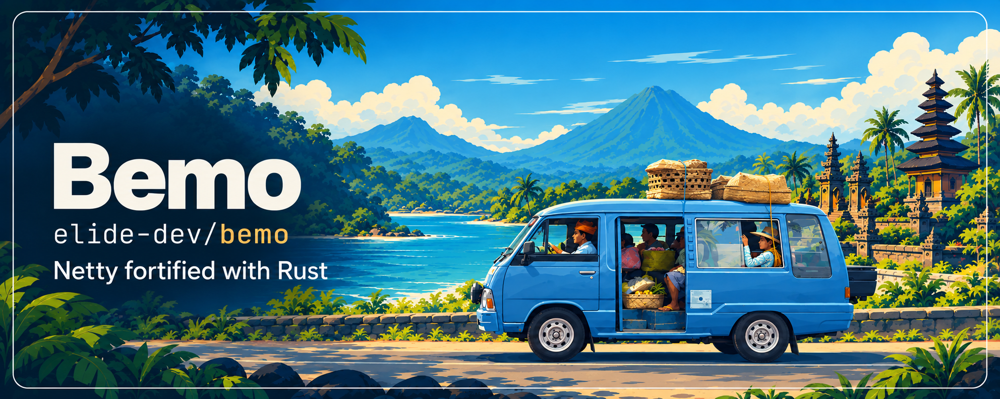
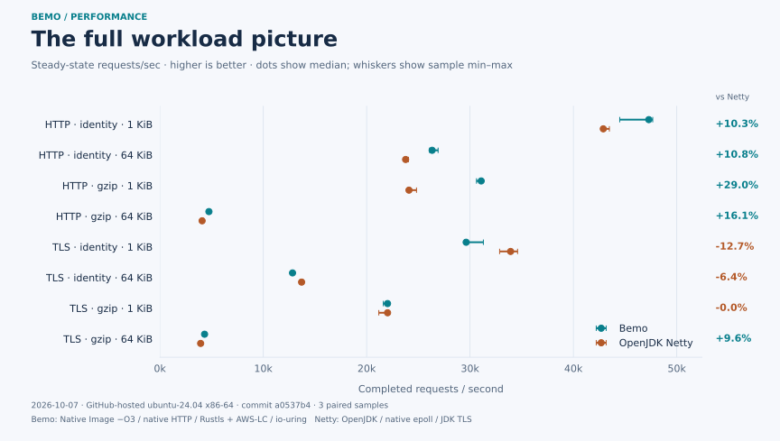
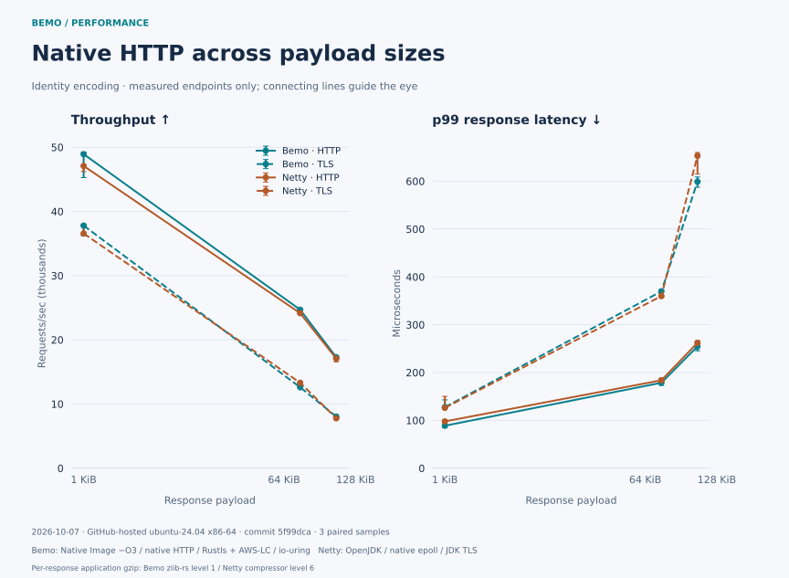
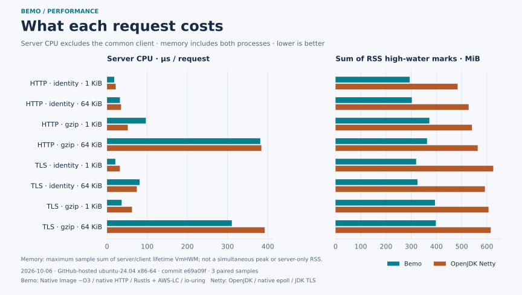

[](https://elide.dev/discord)


[](https://codecov.io/gh/elide-dev/bemo)
[](https://codspeed.io/elide-dev/bemo)

> A [_Bemo_][0] is a traditional, small open-air minibus or motorized rickshaw used as fast local **transport, especially in [Bali](https://github.com/elide-dev/bali)**.

---

# Netty fortified by Rust

_Bemo_ is a drop-in [native transport](https://netty.io/wiki/native-transports.html) for [Netty](https://netty.io), built with Rust, using best-of-breed APIs and libraries like [`io_uring`](https://en.wikipedia.org/wiki/Io_uring), [`tokio`](https://tokio.rs/), [`aws-lc-rs`](https://github.com/aws/aws-lc-rs), [`rustls`](https://github.com/rustls/rustls), [`zlib-rs`](https://trifectatech.org/blog/zlib-rs-is-faster-than-c/), [`ntex`](https://ntex.rs/), and [`simdutf`](https://github.com/simdutf/simdutf).

| Status | Feature |
| ------ | ------- |
| ✅ Drop-in | Replacement for Netty native transports (`io_uring`, `epoll`, `kqueue`) |
| ✅ Drop-in | Replacement for Netty "Tomcat Native" (`tcnative`) TLS |
| ✅ JVM parity | Meets or beats Netty's stock native transports on JVM |
| ✅ SVM parity | Beats Netty's native transports via `native-image` |

_Bemo_ is used as the main transport for [Elide](https://github.com/elide-dev/elide).

## Usage

**Via Rust:**

```toml
[dependencies]
bemo = { git = "https://github.com/elide-dev/bemo", rev = "<full-commit-sha>" }
bemo-ffi = { git = "https://github.com/elide-dev/bemo", rev = "<full-commit-sha>" }
```

**Via JVM/SVM:**

The Maven coordinates are `dev.elide.bemo:bemo-api`, `bemo-ffm`,
`bemo-native-image`, and `bemo-netty`. Snapshot artifacts, sources, Javadocs,
and native classifiers are available from [GitHub Packages](docs/publishing.md). The FFM and
Native Image artifacts depend on the API artifact. GraalVM SDK dependencies
are confined to the Native Image artifact and marked `provided`.

```java
import dev.elide.bemo.transport.FfmTransportNative;
import dev.elide.bemo.transport.NativeIoHandler;
import dev.elide.bemo.transport.NativeServerSocketChannel;
import dev.elide.bemo.transport.Workload;
import io.netty.channel.MultiThreadIoEventLoopGroup;

var transport = new FfmTransportNative();
var group = new MultiThreadIoEventLoopGroup(
    2, NativeIoHandler.newFactory(transport, 0, 128, 8 * 1024 * 1024));
// Supply group and NativeServerSocketChannel.class to a Netty ServerBootstrap.
// After channels are closed:
group.shutdownGracefully().sync();
Workload.close(transport, Workload.DEFAULT);
```

For Native Image, construct `dev.elide.bemo.transport.svm.CapiTransportNative` instead.
The transport binding retains its library for process lifetime; caller-owned
workloads and event loops have explicit shutdown. See the executable contracts
in `tests/transport/java` for complete TCP, Unix socket, and TLS examples.

Run with `--enable-native-access=ALL-UNNAMED`. Include the base FFM JAR and its
platform classifier JAR; the no-argument constructor extracts and loads the
shared library automatically. Static archives ship in the Native Image classifier.
See [native loading](docs/native-loading.md) for configuration. Netty TLS uses
a package-private ALPN adapter and currently requires the classpath rather than JPMS. See [architecture](docs/architecture.md), [extraction boundaries](docs/extraction.md),
[Netty I/O ownership and batching](docs/transport-io.md).

## Performance

Bemo puts HTTP parsing, response encoding, socket I/O, and Rustls/aws-lc-rs TLS
in Rust. These comparisons run Bemo as an optimized Native Image against stock
OpenJDK Netty with its native epoll transport. Both use the same external client.







Snapshot: Linux x86-64, three paired samples per workload,
[paired benchmark run on October 7, 2026 (UTC)](https://github.com/elide-dev/bemo/actions/runs/37581322288).
Both the merged stack and performance follow-ups were rebuilt and measured on
the same runner; see [the follow-up results](docs/performance/performance-updates.md)
for throughput, latency, CPU, and memory changes across all eight workloads.
These are closed-loop, full-stack comparisons on a shared hosted runner.
Gzip includes native zlib-rs application compression for every Bemo response;
Netty uses its own compressor. Memory is the sum of
process lifetime high-water marks, including the client. Lines connect measured endpoints;
they do not predict intermediate payload sizes.

The charts and their raw samples are checked in. Run `make bench-graphs` to
reproduce them; see [updating the charts](docs/performance/README.md) for
re-benching, data provenance, and refresh commands.

## Layout

| Path | Responsibility |
| --- | --- |
| `crates/bemo` | Runtime-independent Rust core; consumable as a Cargo Git dependency |
| `crates/bemo-ffi` | One C boundary, built as `rlib`, `staticlib`, and `cdylib` |
| `include` | Bemo metadata ABI and preserved Elide transport ABI 3 |
| `packages/api` | JVM contract without runtime dependencies |
| `packages/ffm` | JDK 22+ dynamic-library adapter |
| `packages/native-image` | GraalVM C interop adapter for static linking |
| `packages/netty` | Stock Netty 4.2 channels, allocator, TLS, and event-loop adapter |
| `tests` | C and shared JVM binding contracts |
| `tools` | Build orchestration and artifact/consumer verification |
| `.github` | Reusable PR, push, merge-queue, check, build, and release-staging workflows |

## Develop

Install Rustup, Python 3.11+, a C toolchain, a JDK 25 build toolchain, and the
Elide version in `.elide-version`. Rustup selects `rust-toolchain.toml`.
Use a GraalVM JDK 25 with `native-image` for the static binding test. AWS-LC
requires CMake; Windows additionally needs NASM or `AWS_LC_SYS_PREBUILT_NASM=1`.
OpenSSL on PATH enables additional TLS interoperability checks.
The FFM artifact targets regular JDK 22+, without preview features.

```sh
make deps
make build
make check
make test
make test-native-image
make package
python3 tools/verify_package.py
```

`make test` covers Rust, an external revision-pinned Cargo Git consumer, a C
consumer, and FFM on the JVM. `make test-native-image` compiles and executes the
same JVM contract against the static C binding. CI tests FFM on Temurin 22 and
25; Rust on Linux, macOS, and Windows; Native Image on Linux. JVM packaging is
initially Linux glibc x86-64 and macOS ARM64. Windows JVM and musl packaging are
not yet qualified.

Set `ELIDE` to select the build executable, `JAVA_HOME` for JVM tools, or
`BEMO_TEST_JAVA` to run the FFM contract with a separate stock JVM. Standard
Cargo `CARGO_TARGET_DIR` is supported. Cross-compilation is not wired into the
host binding tests or packaging commands. Build commands share output folders;
run them sequentially in a checkout.

## Licensing

Licensed under Apache-2.0.

Test XML, coverage, and continuous CPU/RPS/RSS benchmarks are described in
[the measurement guide](docs/measurement.md).
ASAN, TSAN, Miri, and bounded native fuzzing are described in
[native safety verification](docs/native-safety.md).

[0]: https://en.wikipedia.org/wiki/Share_taxi#Indonesia
