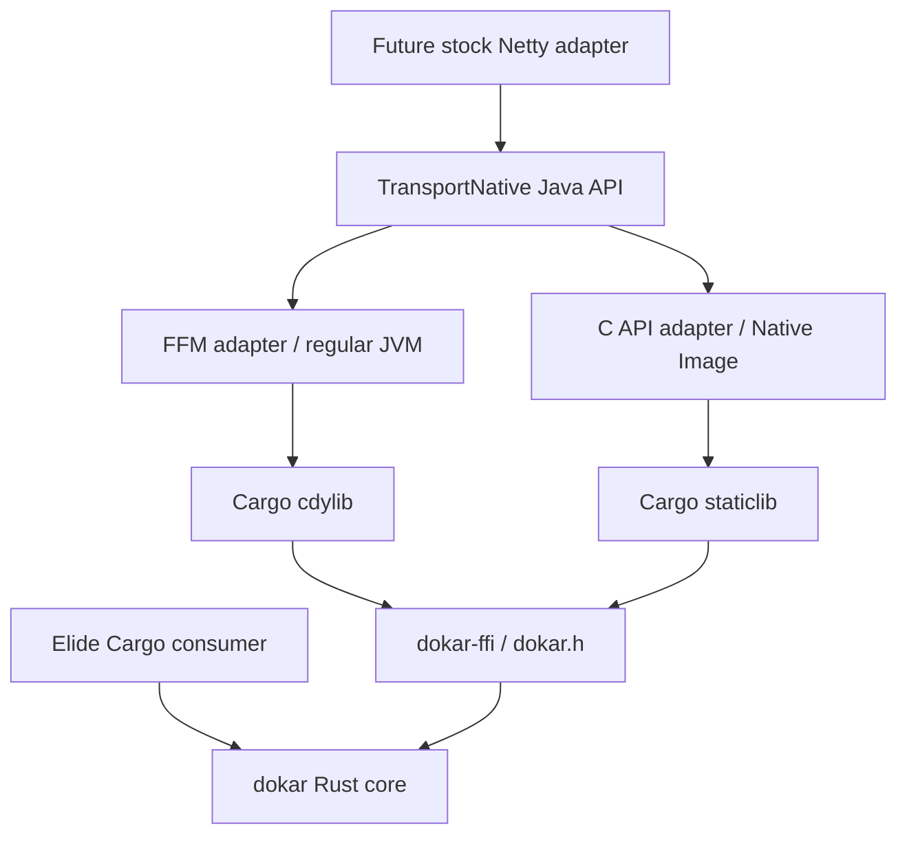

# Architecture and compatibility

The two Java implementations share a contract and native symbols. They are
alternative execution paths, not duplicate implementations of transport
logic. Cargo's `rlib` path lets Elide embed the same Rust implementation.
Only the Native Image adapter imports GraalVM SDK classes. There is no JNI
bridge, Elide runtime dependency, or Truffle dependency in the skeleton.

## ABI policy

Dokar ABI 1 is a new, metadata-only boundary; it is **not** a compatibility
alias for Elide transport ABI 3. It exports `dokar_abi_version` (`uint32_t`)
and `dokar_capabilities` (`uint64_t`). Both are allocation-free and usable
from any thread. Capability bits remain zero until the data plane arrives.

The FFM constructor resolves the version symbol and rejects incompatible
libraries before resolving other symbols. A shared arena retains the library
for the lifetime of that binding; close only after all calling threads finish.
The Native Image adapter uses `@CContext`, `@CFunction`, and a required static
`@CLibrary`. `dokar.h` is consumed directly by the C and Native Image tests.

During extraction, define each ownership operation once: creator, valid caller
threads, transfer on success/failure, completion lifetime, and release behavior.
Keep opaque handles and fixed-width C types. Never unwind Rust panics through
foreign frames; exported operations that can panic will need an explicit
containment policy. The current exports cannot panic; release builds also use
`panic = "abort"`.

ABI version changes are for incompatible calling/layout changes. Additive
features should use capability bits and documented layouts. The release
version (`.version` and Cargo's workspace version) is independent of the ABI
version. Tests must reject mismatches and protect unavailable capabilities.

## Toolchains and outputs

`tools/build.py` is orchestration, not a JVM build-system replacement. It calls
Elide `install`, `javac`, `java`, and `jar`; Cargo builds native libraries.
The pinned Elide version's high-level JAR task did not find its Java compiler's
output in initial validation, so packaging invokes its working `jar` command
explicitly. `elide.pkl` remains the dependency/source manifest. Compilation
uses `--release 22`, explicit per-artifact classpaths, and warnings as errors.

JVM classpaths are assembled from exact pinned artifacts, never all jars from
Elide's dependency cache. This excludes Elide's implicit project dependencies
and formatter dependencies from the published modules. The FFM contract is
launched with ordinary `java`, and also runs against packaged JARs plus an
extracted native classifier to detect packaging mistakes.

Native classifiers identify OS, architecture, and (on Linux) libc. The current
Linux classifier is `linux-x86_64-gnu`; it does not promise a glibc compatibility
floor below the CI builder. A release must establish and test that floor before
claiming broad Linux binary compatibility.

References: [JDK SymbolLookup](https://docs.oracle.com/en/java/javase/25/docs/api/java.base/java/lang/foreign/SymbolLookup.html),
[GraalVM CFunction](https://www.graalvm.org/23.0/javadoc/sdk/org/graalvm/nativeimage/c/function/CFunction.html).
