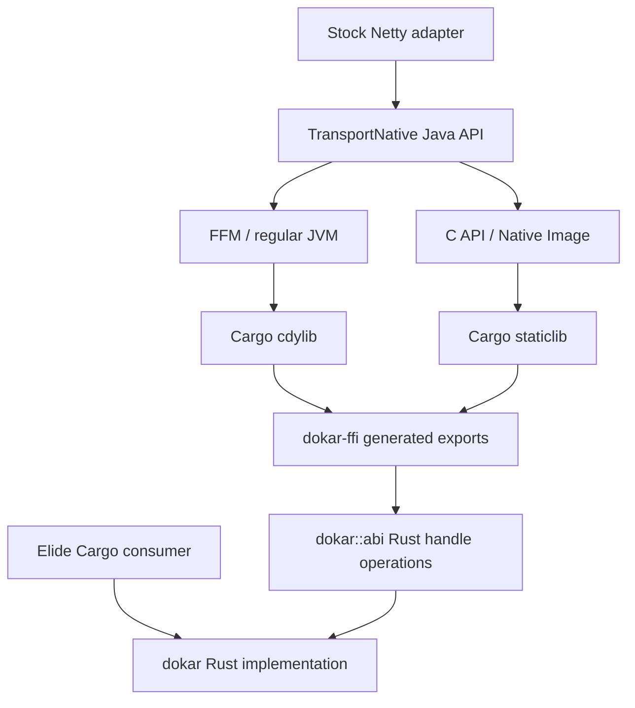

# Architecture and compatibility

The Rust transport implementation and handle state live together in `dokar`,
retaining crate-private ownership invariants. Those Rust functions no longer
export unmangled C symbols. `dokar-ffi` supplies generated forwarding functions;
`tools/generate_exports.py --check` compares their signatures with the Rust
entrypoints and ensures the symbol set matches `include/elide_transport.h`.
Each forwarding call delegates to the same implementation; no transport logic
is duplicated. The external Git consumer tests that a buffer created through
Rust can be released through C against the same handle registry.

## ABI and lifetime

Elide transport ABI 3 (`elide_transport_*`) remains unchanged. The JVM interface
and adapter packages now use `dev.elide.dokar.transport`. Elide cutover requires
updated Java imports as well as dependency, linking, and source-ownership changes.

Dokar's separate metadata ABI 1 (`dokar_abi_version`, `dokar_capabilities`) is
retained from the foundation. Capability bit `DOKAR_CAP_TRANSPORT_V3` means the
complete legacy transport boundary is present. It does not assert that every
OS backend is available at runtime: AUTO selects a supported backend, and
io_uring setup failure can fall back to polling. The `dev.elide.dokar` classes
exercise this metadata boundary; the `dev.elide.dokar.transport` classes carry traffic.

The transport FFM adapter validates ABI 3 before resolving other symbols and
retains the shared library for process lifetime. Buffers, workloads, drivers,
TLS contexts, and event loops must still be released according to their own
contracts. Do not unload the library while channels or native views remain.
The Native Image adapter uses `@CContext`, `@CFunction`, and static `@CLibrary`.
Both use the same exported symbols and run the imported contract suite.

Opaque handles, fixed-width layouts, workload checks, callback reentrancy,
owner-thread confinement, and cancellation/completion lifetimes are preserved.
Rust panics may not unwind through the generated `extern "C"` entries; as in
the original transport, such a panic terminates the process. Release builds
also use `panic = "abort"`.

The C API adapter uses GraalVM's public `CTypeConversion` buffer views for byte
copies and standard exceptions. It has no Elide `Unsafe`, stackless-exception
helper, or Truffle annotation dependency. `NativeRegion` remains in Elide.

## Artifacts and toolchains

`dokar-api` has no Netty, GraalVM, or Elide runtime dependency. `dokar-ffm`
depends on that API; `dokar-native-image` adds provided GraalVM SDK dependencies;
`dokar-netty` adds stock Netty. Netty TLS's ALPN helper lives in Netty's package,
so this integration currently supports the classpath rather than JPMS.

`tools/build.py` calls Elide `install`, `javac`, `java`, and `jar`; Cargo builds
native libraries. The pinned Elide version's high-level JAR task did not find
its Java compiler output, so packaging uses its working `jar` command directly.
Compilation uses `--release 22`, exact per-artifact classpaths, and warnings as
errors. Compatibility overrides retain narrowly scoped warning suppressions.

Native classifiers identify OS, architecture, and Linux libc. The current
`linux-x86_64-gnu` artifact does not promise a glibc floor below its builder.
A release must establish and test that floor before broad binary compatibility
is claimed. The pinned Rust nightly is the qualified compiler; no independent
MSRV guarantee is made yet.
