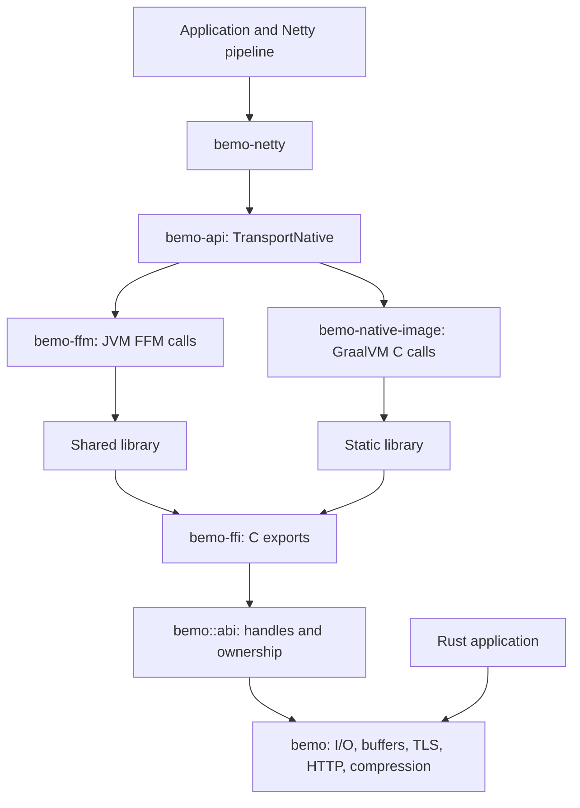

# Architecture

Bemo has a Rust transport core, a C interface, and Java bindings. Netty uses
those bindings for sockets, buffers, TLS, and compression. A Rust application
can call the core directly.

## Components



| Component | Responsibility |
| --- | --- |
| [`crates/bemo`](../crates/bemo/src/lib.rs) | Native I/O, allocation budgets, buffers, TLS, HTTP, and compression |
| [`bemo::abi`](../crates/bemo/src/abi.rs) | Handle lookup, ownership checks, and operations shared by C and Rust callers |
| [`crates/bemo-ffi`](../crates/bemo-ffi/src/lib.rs) | Exported C functions and shared/static libraries |
| [`include`](../include) | Public C declarations and record layouts |
| [`bemo-api`](../packages/api/src/main/java/dev/elide/bemo/transport/TransportNative.java) | Java interface used by both bindings |
| [`bemo-ffm`](../packages/ffm) | JDK 22+ FFM binding and shared-library loading |
| [`bemo-native-image`](../packages/native-image) | GraalVM C binding and static linkage |
| [`bemo-netty`](../packages/netty) | Netty 4.2 channels, event-loop integration, buffers, and TLS adapters |

The Rust core has no JVM, Netty, GraalVM, or Elide runtime dependency.
`bemo-ffi` forwards calls into `bemo::abi`; it does not implement a second
transport. `bemo-api` and `bemo-ffm` have no GraalVM or Elide runtime dependency.

## From a Netty write to the socket

1. An application writes a `ByteBuf` through its Netty pipeline.
2. `NativeStreamChannel` collects flushed buffers into a bounded batch.
3. The selected Java binding calls the C interface.
4. Rust validates the workload, socket, and buffer ownership, then submits the
   send through its CompIO driver.
5. On completion, the adapter advances the outbound buffers by the number of
   bytes written. A partial write leaves the remaining bytes queued.

On Unix backends, an eligible write can finish during the call. The driver
borrows direct memory only until the syscall returns. A pending send instead
retains its own buffer lease until kernel access ends. See
[I/O ownership and batching](transport-io.md) for the send and receive rules.

Each `NativeIoHandler` owns a native driver on its event-loop thread. Other
threads can wake that driver; they do not execute its callbacks. Workloads group
operations for cancellation and resource accounting. Closing one workload does
not cancel another workload's operations.

## I/O backends

| Backend | Platform | Operation model |
| --- | --- | --- |
| Polling | Linux epoll, macOS kqueue | Readiness notifications and nonblocking syscalls |
| io_uring | Linux | Submitted operations and completion events |
| IOCP | Windows | Submitted operations and completion events |

`AUTO` selects a backend for the host. On Linux it tries io_uring and falls back
to polling if ring setup fails. An explicit backend request reports failure
instead of falling back. The driver records why automatic selection fell back. After startup,
`DriverSelection.observed().describe()` reports the latest observed event-loop
selection, including an AUTO fallback reason. On an owner thread, the API's
`driverBackend(driver)` returns the actual backend code; `driverFallback` writes
the reason into a workload-owned mutable buffer. `DriverSelection.of` wraps
those operations. It is an observation, not a guarantee about future drivers.

Backend support and published Java packages have different scopes. Release
classifiers currently cover Linux x86-64 with glibc and macOS ARM64. The
[package guide](publishing.md) lists the tested OS versions and linking options.

## TLS, compression, and HTTP

Rustls handles TLS, using AWS-LC for cryptography. The Netty integration supports
transport-owned TLS through `NativeTlsContext` and an `SSLEngine` adapter through
`NativeSslContext`. Transport-owned TLS feeds ciphertext to Rustls below the
application pipeline and delivers plaintext to Netty. It retains outgoing TLS
records across partial writes until the socket has accepted the whole record.

Compression uses zlib-rs. Applications choose Bemo's compression integration
explicitly; selecting a Bemo channel alone does not replace an application's
HTTP codecs or compression handlers. The [framework examples](framework-examples.md)
show the choices for Spring Boot, Micronaut, and Ktor.

The [standalone JVM quickstart](installation.md) and Spring Boot/Micronaut/Ktor
examples use Netty/framework HTTP codecs over Bemo channels. Transport is selected
through `NativeIoHandler` and the native channel classes. TLS additionally needs
`NativeTlsContext` or `NativeSslContext`; compression additionally needs a Bemo
encoder/handler. One dependency or channel substitution does not enable all three.

The Rust core also has HTTP/1 and HTTP/2 handling. Its native HTTP/TLS path can
serve requests without going through Netty channels. This is a separate path
from framework applications that keep their Netty HTTP codecs. The
[benchmark reports](performance/README.md) identify which path each run uses.
The [runnable native HTTP workload](native-http-example.md) exercises the C ABI's
HTTP/1.1 server path, including optional TLS and gzip. Its tested scope does not
establish an HTTP/2 or client example.

## Handles and memory

C and Java callers use opaque handles for native resources. The handle owns a
resource reference; a pointer or `ByteBuffer` view only borrows its memory.
Handles are checked against the operation's workload and driver where required.
Driver operations run on their owning thread.

Mutable buffers expose writable storage. Freezing a buffer makes its initialized
bytes available as immutable storage that can be sliced or retained for a send.
A pending kernel operation holds a lease independently of the caller's handle.
Releasing the handle or requesting cancellation does not end kernel access.
Memory is reclaimed after the operation retires and its remaining references
are released.

Allocation budgets account for native storage, including pinned receive
capacity. They prevent an application from hiding native allocations outside its
configured owner budget. The [ownership guide](transport-io.md) describes
backpressure, reuse, and shutdown in more detail.

## Native-buffer allocator selection

[`buffer.rs`](../crates/bemo/src/buffer.rs) pairs allocation and deallocation for
Bemo's native buffer storage. Default builds, including the standard Linux
release binaries, enable `bundled-mimalloc`: `libmimalloc-sys` supplies mimalloc
on non-Apple targets. This is a buffer allocator choice, not replacement of the
JVM's garbage-collected heap or a claim that every Rust allocation uses mimalloc.

Apple targets route this storage through Rust allocation even with the default
feature selected, avoiding a second bundled mimalloc instance in an embedding
process. Thus the standard macOS classifier uses Rust allocation for these buffers.

Custom builds select Cargo features at build time:

```sh
# Use Rust allocation for buffers.
cargo build -p bemo-ffi --release --locked --no-default-features --features rust-allocator
# Build the Rust core for embedding; the final linker must supply mi_malloc/mi_free.
cargo build -p bemo --release --locked --no-default-features
```

On non-Apple targets outside Miri, `bundled-mimalloc` and `rust-allocator` together
are rejected at compile time. Selecting neither requires externally supplied
mimalloc symbols on those targets. There is no runtime allocator switch.
Callers release buffers through the creating Bemo binding and its handle APIs;
they must not free Bemo views with another allocator. Kernel leases keep storage
alive until operations retire, independently of the caller's handle.

## Shared cryptography upstream

The two paths are:

- Bemo → rustls → aws-lc-rs → AWS-LC.
- Java JCA/JCE → Amazon Corretto Crypto Provider (ACCP) → AWS-LC.

[AWS describes ACCP 2's use of AWS-LC](https://aws.amazon.com/blogs/security/accelerating-jvm-cryptography-with-amazon-corretto-crypto-provider-2/).
AWS-LC is the common upstream implementation; `aws-lc-rs` is Bemo's Rust binding.
This permits alignment on one upstream cryptography implementation. It does not
establish one linked binary, shared state, matching versions/configurations, or
automatic installation of ACCP. The release does not establish binary
deduplication or a single shared AWS-LC instance. Shared ancestry also does not
establish FIPS qualification; that requires evidence for the applicable module,
configuration, and deployment.

## JVM and Native Image bindings

On a regular JVM, `FfmTransportNative` loads the shared library from the platform
classifier JAR and calls it through FFM. The transport binding retains its library
mapping for process lifetime. Channels, drivers, buffers, and TLS contexts still
need to be closed. Independent class loaders can load separate handle registries;
handles must stay with the binding that created them.

Native Image uses `CapiTransportNative` and generated `@CFunction` imports. The
Bemo static archive is linked into the executable, so this path needs no shared
library extraction at startup. It uses the same C functions and ownership rules
as FFM. Both bindings run the shared Java transport contract.

Direct C ABI calls and transition-free calls are separate mechanisms. The
[generated imports](../packages/native-image/src/main/java/dev/elide/bemo/svm/generated/BemoNatives.java)
use ordinary `@CFunction` calls as well as selected
`CFunction.Transition.NO_TRANSITION` calls. The pinned GraalVM SDK 25.3.4.1
`CFunction` source specifies that transition-free calls must not block or call
back into Java; long calls delay other threads' safepoints and garbage collection.
See the [GraalVM transition contract](https://www.graalvm.org/sdk/javadoc/org/graalvm/nativeimage/c/function/CFunction.Transition.html).
These calls must therefore stay appropriately short. Not every call is
transition-free, and static linkage alone does not enable cross-language inlining.

`@CFunction` avoids JNI's calling protocol, extra environment parameters, and
Java object-handle processing. That architectural advantage does not establish
universal throughput superiority over JNI. Numerical boundary-overhead claims
need a controlled benchmark holding native work and data handling constant;
that measurement is a separate follow-up.

Netty's TLS ALPN bridge accesses a package-private Netty interface. Use the
classpath for this integration; named JPMS modules are not supported.
See [native loading](native-loading.md) for extraction settings and
[generated imports](generated-seam.md) for Native Image and ThinLTO details.

## ABI compatibility

There are two versioned interfaces:

| Interface | Version | Purpose |
| --- | --- | --- |
| `bemo_*` | 1 | Metadata and capability discovery |
| `elide_transport_*` | 3 | Buffers, drivers, sockets, TLS, and HTTP operations |

The transport symbols keep their Elide names for compatibility. The transport
FFM binding checks ABI 3 before resolving the remaining functions.
`BEMO_CAP_TRANSPORT_V3` reports that this transport interface is present; it does
not promise that a particular OS backend is available.

C layouts use fixed-width fields. Generated exports are checked against the
Rust signatures and public headers. Native Image imports are generated from the
same interface description. Rust panics cannot unwind through C calls; a panic
at this boundary terminates the process.

## Building and checking changes

Cargo builds Rust and the native libraries. Elide resolves Java dependencies,
compiles Java, and creates the JARs. Java compilation targets release 22.
Packaging combines those outputs without recompiling them.

Run `make check` for source, signature, and layout checks, `make test` for Rust,
C, and FFM contracts, and `make test-native-image` for the static Java binding.
ABI changes must update both bindings and pass the shared contracts. See
[checks](checks.md) and [native safety](native-safety.md) for the full test map.
